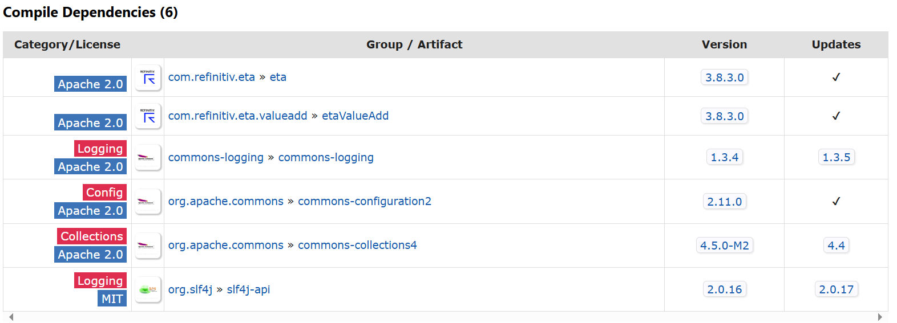
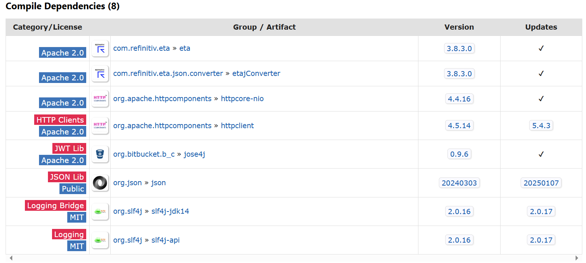

# How to integrate Enterprise Message API Java with Log4j Logging Framework using Maven

## How to integrate EMA Java Application with Logging Framework in Maven

Moving on to EMA and Maven configuration. The Real-Time SDK Java is now available in [Maven Central Repository](https://search.maven.org/). You can define the following dependency in Maven's pom.xml file to let Maven automatically download the [EMA Java library](https://search.maven.org/artifact/com.refinitiv.ema/ema/) and [ETA Java library](https://search.maven.org/artifact/com.refinitiv.eta/eta) for an application.

```xml
<properties>
    <maven.compiler.source>11</maven.compiler.source>
    <maven.compiler.target>11</maven.compiler.target>
    <rtsdk.version>3.8.3.0</rtsdk.version>
</properties>

<dependencies>
    <dependency>
        <groupId>com.refinitiv.ema</groupId>
        <artifactId>ema</artifactId>
        <version>${rtsdk.version}</version>
    </dependency>
</dependencies>
``` 

Note: 
- This article is based on EMA Java version 3.8.3 (RTSDK Java Edition 2.2.3 L1). You can change the library version in ```<version>``` configuration to match your project.
- Please be noticed that I use the  [Maven variables](https://maven.apache.org/guides/introduction/introduction-to-the-pom.html#project-interpolation-and-variables) ```<rtsdk.version>3.8.3.0</rtsdk.version>``` to set the library version in a single place in the pom.xml file.

Since RTSDK 1.5.1, The EMA uses ETA Java ValueAdd API to bind the SLF4J logging mechanism with [Java Logging API](https://docs.oracle.com/javase/8/docs/technotes/guides/logging/overview.html) as a default logger instead of the EMA API itself (the previous versions EMA API binds SLF4J-Java Logging API directly). When developers add ```ema``` library dependency in a Maven ```pom.xml``` file, Maven automatically downloads the ```etaValueAdd``` library which also downloads the  ```slf4j-api``` and ```slf4j-jdk14``` libraries for an application too. 





Developers can perform the following steps to integrate the EMA Java Maven application log with Log4j framework. 

1. Configure pom.xml file's EMA dependency declaration to not load slf4j-jdk14 library.
2. Add SLF4J-Log4j and Log4j dependencies in pom.xml file (see [Installing SLF4J-to-Log4j bridge](https://logging.apache.org/log4j/2.x/manual/installation.html#impl-core-bridge-slf4j) page).
3. Configure Log4j configurations file to Java classpath or JVM option.

## Maven pom.xml setting for EMA Java and Log4j 

Developers can configure the EMA dependency declaration in the pom.xml file to exclude the SLF4J-JDK14 library using [Maven Dependency Exclusions](https://maven.apache.org/guides/introduction/introduction-to-optional-and-excludes-dependencies.html) feature.

```xml
<dependency>
	<groupId>com.refinitiv.ema</groupId>
	<artifactId>ema</artifactId>
	<version>${rtsdk.version}</version>
	<exclusions>
		<exclusion>
			<groupId>org.slf4j</groupId>
			<artifactId>slf4j-jdk14</artifactId>
		</exclusion>
	</exclusions>
</dependency>
```

The Log4j 2 framework requires the following dependencies to integrate with SLF4J framework. 
- [log4j-api](https://central.sonatype.com/artifact/org.apache.logging.log4j/log4j-api)
- [log4j-core](https://central.sonatype.com/artifact/org.apache.logging.log4j/log4j-core)
- [log4j-slf4j2-impl](https://central.sonatype.com/artifact/org.apache.logging.log4j/log4j-slf4j2-impl) (Note, EMA 3.8.3 uses SLF4J version 2.0.16, that is why you need the log4j-slf4j**2**-impl library)

The dependencies above can be configured in the pom.xml file.

```xml
<properties>
	<project.build.sourceEncoding>UTF-8</project.build.sourceEncoding>
	<maven.compiler.source>11</maven.compiler.source>
	<maven.compiler.target>11</maven.compiler.target>
	<rtsdk.version>3.8.3.0</rtsdk.version>
	<log4j.version>2.24.3</log4j.version>
</properties>

<dependencies>
    <dependency>
        <groupId>org.apache.logging.log4j</groupId>
        <artifactId>log4j-api</artifactId>
        <version>${log4j.version}</version>
    </dependency>

    <dependency>
        <groupId>org.apache.logging.log4j</groupId>
        <artifactId>log4j-core</artifactId>
        <version>${log4j.version}</version>
    </dependency>

    <dependency>
        <groupId>org.apache.logging.log4j</groupId>
        <artifactId>log4j-slf4j2-impl</artifactId>
        <version>${log4j.version}</version>
    </dependency>
</dependencies>
```

Note: You can change the library version in ```<version>``` configuration to match your project.

That covers the EMA and Maven configuration.

## Example Log4j 2 configurations file

That brings us to the Log4j configuration. The example of Log4j 2 configuration file for EMA Java application is the following.

```xml
<?xml version="1.0" encoding="UTF-8"?>
<Configuration>
    <Appenders>
        <Console name="Console" target="SYSTEM_OUT">
            <PatternLayout pattern="current date-%d LEVEL-%-5p Thread-[%t]  Method-%M()   Class name-%C   Message-%m%n"/>
        </Console>
        <File name="File" fileName="logs/ema_log4j.log" immediateFlush="false" append="false">
            <PatternLayout pattern="current date-%d LEVEL-%-5p Thread-[%t]  Method-%M()   Class name-%C   Message-%m%n"/>
        </File>
    </Appenders>
    <loggers>
        <Logger name="com.refinitiv.ema" level="TRACE"/>
        <root level="TRACE">
            <appender-ref ref="Console"/>
            <appender-ref ref="File"/>
        </root>
    </loggers>
</Configuration>
```

The configurations example file above sets the Log4j to print all EMA Java API (```com.refinitiv.ema``` package) logs messages to console and *ema_log4j.log* log file. Please find a full detail of Log4j configuration parameters in [Log4j manual page](https://logging.apache.org/log4j/2.x/manual/configuration.html).


## EMA Java applications and Log4j Demo

Now we come to the demo applications. This project contains the EMA Java demo examples in *ema_example* folder. The demo applications utilize Log4j to logs messages via console and file. The demo examples are the following:

- *IProvider_App example*: OMM Interactive-Provider application. 
- *Consumer_App example*: OMM Consumer application that connects and consumes data from IProvider_App example.

*Note*: The Consumer_App demo example can be configured to connect to your local Real-Time Advanced Distribution Server.

### Application Code Walkthrough

The demo applications are the EMA Java Consumer application connects to the EMA Java IProvider application via the RSSL connection. Both applications use SLF4J's ```logger.info()``` and ```logger.error()``` methods in the source codes to log the application messages instead of ```System.out.println()``` method like the following example codes.

EMA Java IProvider Code:

```java
import org.slf4j.Logger;
import org.slf4j.LoggerFactory;
...
public class IProvider_App {

	private static final Logger logger = LoggerFactory.getLogger(IProvider_App.class);

	public static void main(String[] args) {
		//BasicConfigurator.configure();
		OmmProvider provider = null;
		try {

			logger.info("Starting IProvider_App application, waiting for a consumer application");

			AppClient appClient = new AppClient();
			FieldList fieldList = EmaFactory.createFieldList();
			UpdateMsg updateMsg = EmaFactory.createUpdateMsg();

			provider = EmaFactory.createOmmProvider(EmaFactory.createOmmIProviderConfig()
					.operationModel(OmmIProviderConfig.OperationModel.USER_DISPATCH), appClient);

			....
		} catch (OmmException | InterruptedException excp) {
			logger.error(excp.getMessage());
		} finally {
			if (provider != null)
				provider.uninitialize();
		}
	}
}


class AppClient implements OmmProviderClient {

	private static final Logger logger = LoggerFactory.getLogger(AppClient.class);

	...
    void processLoginRequest(ReqMsg reqMsg, OmmProviderEvent event) {
		logger.info("IProvider_App.AppClient: Received Consumer Login Request Message");
		event.provider()
				.submit(...);
		
		logger.info("IProvider_App.AppClient: Sent Login Refresh message");
	}

	void processMarketPriceRequest(ReqMsg reqMsg, OmmProviderEvent event) {
		if (itemHandle != 0) {
			processInvalidItemRequest(reqMsg, event);
			return;
		}

		FieldList fieldList = EmaFactory.createFieldList();

		fieldList.add(EmaFactory.createFieldEntry().ascii(3, reqMsg.name()));
		fieldList.add(EmaFactory.createFieldEntry().enumValue(15, 840));
		fieldList.add(EmaFactory.createFieldEntry().real(21, 3900, OmmReal.MagnitudeType.EXPONENT_NEG_2));
        ...

		event.provider().submit(...);
		logger.info("IProvider_App.AppClient: Sent Market Price Refresh messages");
		itemHandle = event.handle();
	}

}

```

EMA Java Consumer Code:

```java
import org.slf4j.Logger;
import org.slf4j.LoggerFactory;

public class Consumer_App {

	private static final Logger logger = LoggerFactory.getLogger(Consumer_App.class);

	public static void main(String[] args) {
		
		OmmConsumer consumer = null;
		String service_name = "ELEKTRON_DD";
		try {

			logger.info("Starting Consumer_App application");
			AppClient appClient = new AppClient();
			
			consumer = EmaFactory.createOmmConsumer(EmaFactory.createOmmConsumerConfig().consumerName("Consumer_1"));

			ReqMsg reqMsg = EmaFactory.createReqMsg();

			logger.info("Consumer_App: Register Login stream");
			consumer.registerClient(reqMsg.domainType(EmaRdm.MMT_LOGIN), appClient);
            ...
			logger.info("Consumer_App: Send item request message");
			consumer.registerClient(reqMsg.clear().serviceName(service_name).name("/EUR="), appClient);

			Thread.sleep(60000); // API calls onRefreshMsg(), onUpdateMsg() and onStatusMsg()
		} catch (InterruptedException | OmmException excp) {
			logger.error(excp.getMessage());
		} finally {
			if (consumer != null)
				consumer.uninitialize();
		}
	}
}

class AppClient implements OmmConsumerClient {

	private static final Logger logger = LoggerFactory.getLogger(AppClient.class);

	public void onRefreshMsg(RefreshMsg refreshMsg, OmmConsumerEvent event) {
		logger.info("Consumer_App.AppClient: Receives Market Price Refresh message");
		logger.info(String.format("Item Name: %s", refreshMsg.hasName() ? refreshMsg.name() : "<not set>"));
		logger.info(String.format("Service Name: %s",refreshMsg.hasServiceName() ? refreshMsg.serviceName() : "<not set>"));

		logger.info(String.format("Item State: %s", refreshMsg.state()));

		logger.info(String.format("%s",refreshMsg));

		logger.info("\n");
	}

	...

}
```

Then Log4j will do the rest for an application based on the ```log4j2.xml``` configuration file.

### Log4j configurations file

My next point is our ```log4j2.xml``` configuration file. The demo applications separate an application log and EMA Java API log messages to consoles and log files. 

- The IProvider_App application messages are printed in console and provider_log4j.log file. 
- The Consumer_App application messages are printed in console and consumer_log4j.log file.
- The EMA Java API logs from both applications are printed in ema_log4j.log file. 

The ```log4j2.xml``` file detail is as follows.

```xml
<?xml version="1.0" encoding="UTF-8"?>
<!--<Configuration status="DEBUG">-->
<Configuration xmlns="https://logging.apache.org/xml/ns"
               xmlns:xsi="http://www.w3.org/2001/XMLSchema-instance"
               xsi:schemaLocation="
                   https://logging.apache.org/xml/ns
                   https://logging.apache.org/xml/ns/log4j-config-2.xsd">

    <Appenders>
        <Console name="LogToConsole" target="SYSTEM_OUT">
            <PatternLayout pattern="%d Class name-%C Message-%m%n"/>
        </Console>
        <File name="emaLogFile" fileName="logs/ema_log4j.log">
            <PatternLayout pattern="%d LEVEL-%-5p Thread-[%t]  Method-%M() Class name-%C   Message-%m%n"/>
        </File>
        <File name="consumerLogFile" fileName="logs/consumer_log4j.log">
            <PatternLayout pattern="%d{HH:mm:ss.SSS} [%t] %-5level %logger{36} - %msg%n"/>
        </File>
        <File name="providerLogFile" fileName="logs/provider_log4j.log">
            <PatternLayout pattern="%d{HH:mm:ss.SSS} [%t] %-5level %logger{36} - %msg%n"/>
        </File>
    </Appenders>

    <Loggers>
		<!-- avoid duplicated logs with additivity=false additivity="false" -->
        <Logger name="com.refinitiv.ema" level="TRACE" additivity="false" >
            <AppenderRef ref="emaLogFile" />
        </Logger>
        <Logger name="com.refinitiv.ema.consumer" level="INFO" additivity="false">
            <AppenderRef ref="LogToConsole"/>
            <AppenderRef ref="consumerLogFile"/>
        </Logger>
        <Logger name="com.refinitiv.ema.provider" level="INFO" additivity="false">
            <AppenderRef ref="LogToConsole"/>
            <AppenderRef ref="providerLogFile"/>
        </Logger>
    </Loggers>
</Configuration>
```

## Running the application with Log4j configuration

So, now let’s look at how to run an application with Log4j configuration. To uses Log4j configurations file, developers can add the Log4j configurations file to the Java classpath or set the JVM option ```-Dlog4j2.configurationFile``` points to the log4j2.xml file at runtime. Please note that if you do not build the application into a *single-all-dependencies jar* file, you need to include the Log4j 2 libraries files in the Java classpath too. 

Example command:

```bash
java -Dlog4j2.configurationFile=resources/log4j2.xml -jar target/rtsdk223L1_maven-1.0-SNAPSHOT-jar-with-dependencies.jar
```

That’s all I have to say about how to run an application with the Logj42 configuration file.