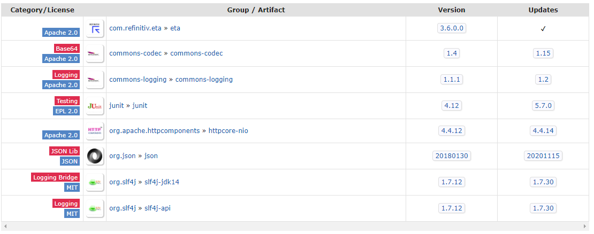

# How to integrate Enterprise Message API Java with Log4j Logging Framework using Maven
## Overview

**Update**: March 2025

**As of December 2021**: There are new serious vulnerabilities that were identified impacting the Apache Log4j utility. Please update the library to the latest version. You can find more detail regarding the vulnerability and the fix from the [Apache Log4j Security Vulnerabilities](https://logging.apache.org/log4j/2.x/security.html) page.
 
[Enterprise Message API - Java Edition (EMA API)](https://developers.lseg.com/en/api-catalog/real-time-opnsrc/rt-sdk-java) (formerly known as Elektron Message API) allows developers integrate the EMA Java application with [Apache Log4j](https://logging.apache.org/log4j/2.x/) which is a de facto standard logging framework for Java-based application at deployment time by using the [Simple Logging Facade for Java (SLF4J)](https://www.slf4j.org/) API as a facade for logging utility. 

The EMA API Java edition has been mavenized to support [Apache Maven](https://maven.apache.org/) and [Gradle](https://gradle.org/) build tools since Refinitiv Real-Time SDK (RTSDK) Java (formerly known as Elektron SDK) version 1.2, therefore this article will show how to integrate your EMA Java 1.3.x application with Log4j in a Maven way.

## IMPORTANT Rebranding Announcement: 

Starting with version RTSDK 2.0.0.L1 (same as EMA/ETA 3.6.0.L1), there are namespace changes and library name changes. Please note that all interfaces remain the same as prior releases of RTSDK and Elektron SDK and will remain fully wire compatible. Along with RTSDK 2.X version, a [REBRAND.md](https://github.com/Refinitiv/Real-Time-SDK/blob/master/REBRAND.md) is published to detail impact to existing applications and how to quickly adapt to the re-branded libraries. Existing applications will continue to work indefinitely as-is.  Applications should be proactively rebranded to be able to utilize new features, security updates or fixes post 2.X release. Please see [PCN](https://myaccount.lseg.com/en/pcnpage/12072?_ga=2.103280071.632863608.1606731450-325683966.1598503157) for more details on support. 

## How to integrate EMA Java Application with Logging Framework in Maven

The Real-Time SDK Java is now available in [Maven Central Repository](https://search.maven.org/). You can define the following dependency in Maven's pom.xml file to let Maven automatically download the [EMA Java library](https://search.maven.org/artifact/com.refinitiv.ema/ema/) and [ETA Java library](https://search.maven.org/artifact/com.refinitiv.eta/eta) for the application.

```
<properties>
    <maven.compiler.source>8</maven.compiler.source>
    <maven.compiler.target>8</maven.compiler.target>
    <rtsdk.version>3.6.3.1</rtsdk.version>
</properties>

<dependencies>
    <dependency>
        <groupId>com.refinitiv.ema</groupId>
        <artifactId>ema</artifactId>
        <version>${rtsdk.version}</version>
    </dependency>
</dependencies>
``` 

Note: 
- This article is based on EMA Java version 3.6.3 L2 (RTSDK Java Edition 2.0.3 L2). You can change the library version in ```<version>``` configuration to match your project.
- Please notice that I use the  [Maven variables](https://maven.apache.org/guides/introduction/introduction-to-the-pom.html#project-interpolation-and-variables) ```<rtsdk.version>3.6.1.0</rtsdk.version>``` to set the library version in a single place in the pom.xml file.

The [ETA Java ValueAdd](https://search.maven.org/search?q=a:etaValueAdd) configuration automatically resolves the API dependencies by downloading the following required libraries for the application.



Since RTSDK 1.5.1, The EMA uses ETA Java ValueAdd API to bind the SLF4J logging mechanism with [Java Logging API](https://docs.oracle.com/javase/8/docs/technotes/guides/logging/overview.html) as a default logger instead of the EMA API itself (the previous versions EMA API binds SLF4J-Java Logging API directly). The Maven automatically downloads **slf4j-api** and **slf4j-jdk14** libraries for the application. Developers can perform the following steps to integrate the EMA Java Maven application log with Log4j framework. 
1. Configure pom.xml file's ETA Java ValueAdd dependency declaration to not load slf4j-jdk14 library.
2. Add SLF4J-Log4j and Log4j dependencies in pom.xml file.
3. Configure Log4j configurations file to Java classpath or JVM option.

### Maven pom.xml setting for EMA Java and Log4j 

Developers can configure the ETA Java ValueAdd Java dependency declaration in the pom.xml file to exclude the SLF4J-JDK14 library using [Maven Dependency Exclusions](https://maven.apache.org/guides/introduction/introduction-to-optional-and-excludes-dependencies.html) feature.

```
<dependency>
    <groupId>com.refinitiv.eta.valueadd</groupId>
    <artifactId>etaValueAdd</artifactId>
    <version>${rtsdk.version}</version>
    <exclusions>
        <exclusion>
            <groupId>org.slf4j</groupId>
                <artifactId>slf4j-jdk14</artifactId>
        </exclusion>
    </exclusions>
</dependency>
```


Note: If you are using the RTSDK 1.5.0 and earlier versions, the ```exclusions``` must be declared in EMA library ```<dependency>``` node.

The Log4j 2 framework requires the following dependencies to integrate with SLF4J framework. 
- log4j-api
- log4j-core
- log4j-slf4j-impl

The above dependencies can be configured in the pom.xml file.

```
<properties>
    <maven.compiler.source>8</maven.compiler.source>
    <maven.compiler.target>8</maven.compiler.target>
    <rtsdk.version>3.6.3.1</rtsdk.version>
    <log4j.version>2.17.1</log4j.version>
</properties>

<dependencies>
    <dependency>
        <groupId>org.apache.logging.log4j</groupId>
        <artifactId>log4j-api</artifactId>
        <version>${log4j.version}</version>
    </dependency>

    <dependency>
        <groupId>org.apache.logging.log4j</groupId>
        <artifactId>log4j-core</artifactId>
        <version>${log4j.version}</version>
    </dependency>

    <dependency>
        <groupId>org.apache.logging.log4j</groupId>
        <artifactId>log4j-slf4j-impl</artifactId>
        <version>${log4j.version}</version>
    </dependency>
</dependencies>
```

Note: You can change the library version in ```<version>``` configuration to match your project.

### Example Log4j 2 configurations file

The example of Log4j 2 configuration file for EMA Java application is the following.

```
<?xml version="1.0" encoding="UTF-8"?>
<Configuration>
    <Appenders>
        <Console name="Console" target="SYSTEM_OUT">
            <PatternLayout pattern="current date-%d LEVEL-%-5p Thread-[%t]  Method-%M()   Class name-%C   Message-%m%n"/>
        </Console>
        <File name="File" fileName="../logs/ema_log4j.log" immediateFlush="false" append="false">
            <PatternLayout pattern="current date-%d LEVEL-%-5p Thread-[%t]  Method-%M()   Class name-%C   Message-%m%n"/>
        </File>
    </Appenders>
    <loggers>
        <Logger name="com.refinitiv.ema" level="TRACE"/>
        <root level="TRACE">
            <appender-ref ref="Console"/>
            <appender-ref ref="File"/>
        </root>
    </loggers>
</Configuration>
```

The above configurations example set the Log4j to print all EMA Java API ("com.refinitiv.ema" package) log messages to console and "ema_log4j.log" log file. Please find a full detail of Log4j configuration parameters in [Log4j manual page](https://logging.apache.org/log4j/2.x/manual/configuration.html).

### Running the application with Log4j configuration

To let the EMA Java application uses Log4j configurations file, developers can add the Log4j configurations file to the Java classpath or set the JVM option ```-Dlog4j.configurationFile``` points to the log4j2.xml file at runtime. Please note that if you do not build the application into a single-all-dependencies jar file, you need to include the Log4j 2 libraries files in the Java classpath too. 

## EMA Java application and Log4j Demo

This project contains the EMA Java demo examples in *ema_example* folder. The demo applications utilize Log4j to manage logs and console messages. The demo examples are the following:
- *IProvider_App example*: OMM Interactive-Provider application. 
- *Consumer_App example*: OMM Consumer application that connects and consumes data from IProvider_App example.

*Note*: The Consumer_App demo example can be configured to connect to your local Real-Time Advanced Distribution
Server.

### Demo log4j configurations file

The demo applications separate the application  logic and EMA Java API log messages to different consoles and log files. 
- The IProvider_App application messages are printed in console and provider_log4j.log file. 
- The Consumer_App application messages are printed in console and consumer_log4j.log file.
- The EMA Java API logs from both applications are printed in ema_log4j.log file. 

The applications just use SLF4J's ```logger.info()``` and ```logger.error()``` functions in the source codes to set the application messages, then Log4j will do the rest for the application based on the following log4j.xml configuration file.

```
<?xml version="1.0" encoding="UTF-8"?>
<Configuration status="DEBUG">

    <Appenders>
        <Console name="LogToConsole" target="SYSTEM_OUT">
            <PatternLayout pattern="%d Class name-%C Message-%m%n"/>
        </Console>
        <File name="emaLogFile" fileName="logs/ema_log4j.log">
            <PatternLayout>
                <Pattern>%d LEVEL-%-5p Thread-[%t]  Method-%M()   Class name-%C   Message-%m%n
                </Pattern>
            </PatternLayout>
        </File>
        <File name="consumerLogFile" fileName="logs/consumer_log4j.log">
            <PatternLayout>
                <Pattern>%d{HH:mm:ss.SSS} [%t] %-5level %logger{36} - %msg%n
                </Pattern>
            </PatternLayout>
        </File>
        <File name="providerLogFile" fileName="logs/provider_log4j.log">
            <PatternLayout>
                <Pattern>%d{HH:mm:ss.SSS} [%t] %-5level %logger{36} - %msg%n
                </Pattern>
            </PatternLayout>
        </File>
    </Appenders>

    <Loggers>
		<!-- avoid duplicated logs with additivity=false -->
        <Logger name="com.refinitiv.ema" level="trace" additivity="false">
            <AppenderRef ref="emaLogFile"/>
        </Logger>
        <Logger name="com.refinitiv.ema.consumer" level="info" additivity="false">
            <AppenderRef ref="LogToConsole"/>
            <AppenderRef ref="consumerLogFile"/>
        </Logger>
        <Logger name="com.refinitiv.ema.provider" level="info" additivity="false">
            <AppenderRef ref="LogToConsole"/>
            <AppenderRef ref="providerLogFile"/>
        </Logger>
    </Loggers>
</Configuration>
```

### Demo prerequisite
This example requires the following dependencies software and libraries.
1. Oracle/Open JDK 8 or Oracle JDK 11.
2. [Apache Maven](https://maven.apache.org/) project management and comprehension tool.
3. Internet connection. 

*Note:* 
The RTSDK Java version 2.0.3 L2 (EMA Java 3.6.3 L2) supports Oracle JDK versions 8, 11, and Open JDK version 8. If you are using other versions of RTSDK Java, please check the SDK's [README.md](https://github.com/Refinitiv/Real-Time-SDK/blob/master/Java/README.md) file regarding the supported Java version.

### Running the demo applications

1. Unzip or download the project into a directory of your choice. 
3. Enter the *ema_example* project folder.
2. Run ```$>mvn package``` command in a console to build the demo applications into a single-all-dependencies *rtsdk203L2_maven-1.0-SNAPSHOT-jar-with-dependencies.jar* file.
3. The applications jar file will be available in the project's *target* folder.
5. Then you can run IProvider_App demo with the following command:
    
    *Windows Command Prompt*
    ```
    $>java -Dlog4j.configurationFile=./resources/log4j2.xml -cp .;target/rtsdk203L2_maven-1.0-SNAPSHOT-jar-with-dependencies.jar com.refinitiv.ema.provider.IProvider_App
    ```
    *Windows Powershell*
    ```
    $>java "-Dlog4j.configurationFile=.\resources\log4j2.xml" -cp '.;target\rtsdk203L2_maven-1.0-SNAPSHOT-jar-with-dependencies.jar' com.refinitiv.ema.provider.IProvider_App
    ```
    *Linux*
    ```
    $>java -Dlog4j.configurationFile=./resources/log4j2.xml -cp .:target/rtsdk203L2_maven-1.0-SNAPSHOT-jar-with-dependencies.jar com.refinitiv.ema.provider.IProvider_App
    ```
6. To run Consumer_App demo, open another console for ema_example folder and run the following command:

    *Windows*
    ```
    $>java -Dlog4j.configurationFile=./resources/log4j2.xml -cp .;target/rtsdk203L2_maven-1.0-SNAPSHOT-jar-with-dependencies.jar com.refinitiv.ema.consumer.Consumer_App
    ```
    *Windows Powershell*
    ```
    $>java "-Dlog4j.configurationFile=.\resources\log4j2.xml" -cp '.;target\rtsdk203L2_maven-1.0-SNAPSHOT-jar-with-dependencies.jar' com.refinitiv.ema.consumer.Consumer_App
    ```
    *Linux*
    ```
    $>java -Dlog4j.configurationFile=./resources/log4j2.xml -cp .:target/rtsdk203L2_maven-1.0-SNAPSHOT-jar-with-dependencies.jar com.refinitiv.ema.consumer.Consumer_App
    ```

### Demo Example Results

#### Consumer_App result
```
15:10:45.983 [main] INFO  com.refinitiv.ema.consumer.Consumer_App - Starting Consumer_App application
15:10:48.678 [main] INFO  com.refinitiv.ema.consumer.Consumer_App - Consumer_App: Register Login stream
15:10:48.680 [main] INFO  com.refinitiv.ema.consumer.Consumer_App - Consumer_App: Register Directory stream
15:10:48.680 [pool-3-thread-1] INFO  com.refinitiv.ema.consumer.AppClient - Consumer_App.AppClient: Receives Market Price Refresh message
15:10:48.681 [main] INFO  com.refinitiv.ema.consumer.Consumer_App - Consumer_App: Send item request message
15:10:48.690 [pool-3-thread-1] INFO  com.refinitiv.ema.consumer.AppClient - Item Name: U8004042
15:10:48.699 [pool-3-thread-1] INFO  com.refinitiv.ema.consumer.AppClient - Service Name: <not set>
15:10:48.699 [pool-3-thread-1] INFO  com.refinitiv.ema.consumer.AppClient - Item State: Open / Ok / None / 'Login accepted'
15:10:48.701 [pool-3-thread-1] INFO  com.refinitiv.ema.consumer.AppClient - RefreshMsg
    streamId="1"
    domain="Login Domain"
    solicited
    RefreshComplete
    state="Open / Ok / None / 'Login accepted'"
    itemGroup="00 00"
    name="U8004042"
    nameType="1"
    Attrib dataType="ElementList"
        ElementList
        ElementListEnd
    AttribEnd
RefreshMsgEnd

15:10:48.733 [pool-3-thread-1] INFO  com.refinitiv.ema.consumer.AppClient - 

15:10:49.672 [pool-3-thread-1] INFO  com.refinitiv.ema.consumer.AppClient - Consumer_App.AppClient: Receives Market Price Refresh message
15:10:49.673 [pool-3-thread-1] INFO  com.refinitiv.ema.consumer.AppClient - Item Name: /EUR=
15:10:49.683 [pool-3-thread-1] INFO  com.refinitiv.ema.consumer.AppClient - Service Name: ELEKTRON_DD
15:10:49.684 [pool-3-thread-1] INFO  com.refinitiv.ema.consumer.AppClient - Item State: Open / Ok / None / 'Refresh Completed'
15:10:49.694 [pool-3-thread-1] INFO  com.refinitiv.ema.consumer.AppClient - RefreshMsg
    streamId="6"
    domain="MarketPrice Domain"
    solicited
    RefreshComplete
    state="Open / Ok / None / 'Refresh Completed'"
    itemGroup="00 00"
    name="/EUR="
    serviceId="1"
    serviceName="ELEKTRON_DD"
    Payload dataType="FieldList"
        FieldList
            FieldEntry fid="3" name="DSPLY_NAME" dataType="Rmtes" value="/EUR="
            FieldEntry fid="15" name="CURRENCY" dataType="Enum" value="840"
            FieldEntry fid="21" name="HST_CLOSE" dataType="Real" value="39.0"
            FieldEntry fid="22" name="BID" dataType="Real" value="39.9"
            FieldEntry fid="25" name="ASK" dataType="Real" value="39.94"
            FieldEntry fid="30" name="BIDSIZE" dataType="Real" value="9.0"
            FieldEntry fid="31" name="ASKSIZE" dataType="Real" value="19.0"
        FieldListEnd
    PayloadEnd
RefreshMsgEnd

15:10:49.694 [pool-3-thread-1] INFO  com.refinitiv.ema.consumer.AppClient - 

15:10:50.674 [pool-3-thread-1] INFO  com.refinitiv.ema.consumer.AppClient - Consumer_App.AppClient: Receives Market Price Update message
15:10:50.675 [pool-3-thread-1] INFO  com.refinitiv.ema.consumer.AppClient - Item Name: /EUR=
15:10:50.677 [pool-3-thread-1] INFO  com.refinitiv.ema.consumer.AppClient - Service Name: ELEKTRON_DD
15:10:50.688 [pool-3-thread-1] INFO  com.refinitiv.ema.consumer.AppClient - UpdateMsg
    streamId="6"
    domain="MarketPrice Domain"
    updateTypeNum="0"
    name="/EUR="
    serviceId="1"
    serviceName="ELEKTRON_DD"
    Payload dataType="FieldList"
        FieldList
            FieldEntry fid="22" name="BID" dataType="Real" value="39.91"
            FieldEntry fid="25" name="ASK" dataType="Real" value="39.94"
            FieldEntry fid="30" name="BIDSIZE" dataType="Real" value="10.0"
            FieldEntry fid="31" name="ASKSIZE" dataType="Real" value="19.0"
        FieldListEnd
    PayloadEnd
UpdateMsgEnd

...
```
#### IProvider_App result

```
15:10:33.972 [main] INFO  com.refinitiv.ema.provider.IProvider_App - Starting IProvider_App application, waiting for a consumer application
15:10:49.671 [main] INFO  com.refinitiv.ema.provider.AppClient - IProvider_App.AppClient: Sent Market Price Refresh messages
15:10:50.674 [main] INFO  com.refinitiv.ema.provider.IProvider_App - IProvider_App: Sent Market Price Update message
15:10:51.674 [main] INFO  com.refinitiv.ema.provider.IProvider_App - IProvider_App: Sent Market Price Update message
15:10:52.675 [main] INFO  com.refinitiv.ema.provider.IProvider_App - IProvider_App: Sent Market Price Update message
```

#### EMA Java result

EMA Java log messages from both demo applications will be in ema_log4j.log file.

```
2020-12-16 15:10:34,565 LEVEL-TRACE Thread-[main]  Method-initialize()   Class name-com.refinitiv.ema.access.OmmServerBaseImpl   Message-loggerMsg
    ClientName: Provider_1_1
    Severity: Trace
    Text:    Print out active configuration detail.
	 itemCountHint: 10000
	 serviceCountHint: 10000
	 requestTimeout: 15000
	 dispatchTimeoutApiThread: 500
	 maxDispatchCountApiThread: 500
	 maxDispatchCountUserThread: 500
	 userDispatch: 0
	 configuredName: Provider_1
	 instanceName: Provider_1_1
	 xmlTraceEnable: false
	 globalConfig.reactorChannelEventPoolLimit: -1
	 globalConfig.reactorMsgEventPoolLimit: -1
	 globalConfig.workerEventPoolLimit: -1
	 globalConfig.tunnelStreamMsgEventPoolLimit: -1
	 globalConfig.tunnelStreamStatusEventPoolLimit: -1
	 defaultServiceName: 14002
	 acceptMessageWithoutAcceptingRequests: false
	 acceptDirMessageWithoutMinFilters: false
	 acceptMessageWithoutBeingLogin: false
	 acceptMessageSameKeyButDiffStream: false
	 acceptMessageThatChangesService: false
	 acceptMessageWithoutQosInRange: false
	 enforceAckIDValidation: false
	 operationModel: 1
	 directoryAdminControl: 1
	 dictionaryAdminControl: 1
	 refreshFirstRequired: true
	 maxFieldDictFragmentSize: 8192
	 maxEnumTypeFragmentSize: 128000
loggerMsgEnd

....

2020-12-16 15:10:35,612 LEVEL-TRACE Thread-[main]  Method-initialize()   Class name-com.refinitiv.ema.access.OmmServerBaseImpl   Message-loggerMsg
    ClientName: Provider_1_1
    Severity: Trace
    Text:    Provider bound on port = 14022.
loggerMsgEnd


2020-12-16 15:10:46,102 LEVEL-TRACE Thread-[main]  Method-initialize()   Class name-com.refinitiv.ema.access.OmmBaseImpl   Message-loggerMsg
    ClientName: Consumer_1_1
    Severity: Trace
    Text:    Print out active configuration detail.
	 itemCountHint: 100000
	 serviceCountHint: 513
	 requestTimeout: 15000
	 dispatchTimeoutApiThread: 0
	 maxDispatchCountApiThread: 100
	 maxDispatchCountUserThread: 100
	 userDispatch: 1
	 configuredName: Consumer_1
	 instanceName: Consumer_1_1
	 xmlTraceEnable: false
	 globalConfig.reactorChannelEventPoolLimit: -1
	 globalConfig.reactorMsgEventPoolLimit: -1
	 globalConfig.workerEventPoolLimit: -1
	 globalConfig.tunnelStreamMsgEventPoolLimit: -1
	 globalConfig.tunnelStreamStatusEventPoolLimit: -1
	 obeyOpenWindow: 1
	 postAckTimeout: 15000
	 maxOutstandingPosts: 100000
	 userDispatch: 1
	 reconnectAttemptLimit: -1
	 reconnectMinDelay: 1000
	 reconnectMaxDelay: 5000
	 msgKeyInUpdates: true
	 directoryRequestTimeOut: 45000
	 dictionaryRequestTimeOut: 45000
	 reissueTokenAttemptLimit: -1
	 reissueTokenAttemptInterval: 5000
	 restRequestTimeOut: 45000
	 tokenReissueRatio: 0.8
	 loginRequestTimeOut: 45000
loggerMsgEnd

...

2020-12-16 15:10:46,371 LEVEL-TRACE Thread-[main]  Method-<init>()   Class name-com.refinitiv.ema.access.CallbackClient   Message-loggerMsg
    ClientName: LoginCallbackClient
    Severity: Trace
    Text:    Created LoginCallbackClient
loggerMsgEnd


2020-12-16 15:10:46,371 LEVEL-TRACE Thread-[main]  Method-initialize()   Class name-com.refinitiv.ema.access.LoginCallbackClient   Message-loggerMsg
    ClientName: LoginCallbackClient
    Severity: Trace
    Text:    RDMLogin request message was populated with this info: 
	LoginRequest: 
	streamId: 1
	userName: U8004042
	streaming: true
	nameType: 1
	applicationId: 256
	applicationName: ema
	position: 192.168.68.113/WIN-V793K3HCLOL

loggerMsgEnd


2020-12-16 15:10:46,372 LEVEL-TRACE Thread-[main]  Method-<init>()   Class name-com.refinitiv.ema.access.CallbackClient   Message-loggerMsg
    ClientName: DictionaryCallbackClient
    Severity: Trace
    Text:    Created DictionaryCallbackClient
loggerMsgEnd
...
```

## Conclusion

The EMA Java API is implemented on top of SLF4J API as a facade for logging utility. The latest version of API allows developers to integrate EMA Java application with the preferred Logging framework by changing the repository, dependencies via their Java project management (Maven or Gradle), and then set the log configuration files without touching the application source code. 

## References
For further details, please check out the following resources:

- [Real-time Java API page](https://developers.lseg.com/en/api-catalog/real-time-opnsrc/rt-sdk-java) on the [LSEG Developer Community](https://developers.lseg.com/) website.
- [Simple Logging Facade for Java (SLF4J)](https://www.slf4j.org/) website.
- [Apache Log4j 2](https://logging.apache.org/log4j/2.x/) website.
- [Enterprise Message API Java Quick Start](https://developers.lseg.com/en/api-catalog/real-time-opnsrc/rt-sdk-java/quick-start)
- [Developer Webinar: Introduction to Enterprise App Creation With Open-Source Enterprise Message API](https://www.youtube.com/watch?v=2pyhYmgHxlU)

For any question related to this article or Enterprise Message API page, please use the Developer Community [Q&A Forum](https://community.developers.refinitiv.com/).
