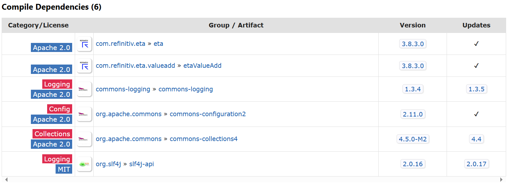

# How to integrate Elektron Message API Java with Log4j Logging Framework using Maven
## Overview
 
[Elektron Message API - Java Edition (EMA API)](https://developers.refinitiv.com/elektron/elektron-sdk-java) allows developers integrate the EMA Java application with [Apache Log4j](https://logging.apache.org/log4j/2.x/) which is a de facto standard logging framework for Java-based application at deployment time by using the [Simple Logging Facade for Java (SLF4J)](https://www.slf4j.org/) API as a facade for logging utility. The [previous article](https://developers.refinitiv.com/article/how-integrate-elektron-message-api-java-edition-log4j-logging-framework) shows how to integrate Log4j with EMA Java application in a manual way which is suitable for earlier versions of EMA Java API. However, the API has been mavenized to support [Apache Maven](https://maven.apache.org/) and [Gradle](https://gradle.org/) build tools since Elektron SDK Java version 1.2, therefore this article will show how to integrate  your EMA Java 1.3.x application with Log4j in a Maven way.

## How to integrate EMA Java Application with Logging Framework in Maven
The Elektron SDK Java are now available in [Maven Central Repository](https://search.maven.org/). You can define the following dependency in Maven's pom.xml fil to let Maven automatic download the [EMA Java library](https://search.maven.org/artifact/com.thomsonreuters.ema/ema/) for the application.

```
<dependency>
  <groupId>com.thomsonreuters.ema</groupId>
  <artifactId>ema</artifactId>
  <version>3.3.1.0</version>
</dependency>
``` 

Note: This article is based on EMA Java version 3.3.1 L1 (Elektron SDK Java Edition 1.3.1). You can change the library version in ```<version>``` configuration to match your project.

The above configuration automatic resolves the API dependencies by downloading the following required libraries for the application. 



The EMA Java API binds the SLF4J logging mechanism with [Java Logging API](https://docs.oracle.com/javase/8/docs/technotes/guides/logging/overview.html) by default, so Maven automatic downloads **slf4j-api** and **slf4j-jdk14** libraries for the application. Developers can perform the following steps to integrate the EMA Java Maven application log with Log4j framework. 
1. Configure pom.xml file's EMA dependency declaration to not load slf4j-jdk14 library.
2. Add SLF4J-Log4j and Log4j dependencies in pom.xml file.
3. Configure Log4j configurations file to Java classpath or JVM option.

### Maven pom.xml setting for EMA JAva and Log4j 
Developers can configure the EMA Java dependency declaration in pom.xml file to exclude the SLF4J-JDK14 library using [Maven Dependency Exclusions](https://maven.apache.org/guides/introduction/introduction-to-optional-and-excludes-dependencies.html) feature.

```
<dependencies>
    <dependency>
        <groupId>com.thomsonreuters.ema</groupId>
        <artifactId>ema</artifactId>
        <version>3.3.1.0</version>
        <exclusions>
            <exclusion>
                <groupId>org.slf4j</groupId>
                <artifactId>slf4j-jdk14</artifactId>
            </exclusion>
        </exclusions>
    </dependency>
</dependencies>
```

The Log4j 2 framework requires the following dependencies to integrate with SLF4J framework. 
- log4j-api
- log4j-core
- log4j-slf4j-impl

The above dependencies can be configured in the pom.xml file.

```
<dependencies>
    <dependency>
        <groupId>org.apache.logging.log4j</groupId>
        <artifactId>log4j-api</artifactId>
        <version>2.12.1</version>
    </dependency>

    <dependency>
        <groupId>org.apache.logging.log4j</groupId>
        <artifactId>log4j-core</artifactId>
        <version>2.12.1</version>
    </dependency>

    <dependency>
        <groupId>org.apache.logging.log4j</groupId>
        <artifactId>log4j-slf4j-impl</artifactId>
        <version>2.12.1</version>
    </dependency>
</dependencies>
```

Note: This article is based on Log4j version 2.12.1. You can change the library version in ```<version>``` configuration to match your project.

### Example Log4j 2 configurations file

The example of Log4j 2 configuration file for EMA Java application is following.

```
<?xml version="1.0" encoding="UTF-8"?>
<Configuration>
    <Appenders>
        <Console name="Console" target="SYSTEM_OUT">
            <PatternLayout pattern="current date-%d LEVEL-%-5p Thread-[%t]  Method-%M()   Class name-%C   Message-%m%n"/>
        </Console>
        <File name="File" fileName="../logs/ema_log4j.log" immediateFlush="false" append="false">
            <PatternLayout pattern="current date-%d LEVEL-%-5p Thread-[%t]  Method-%M()   Class name-%C   Message-%m%n"/>
        </File>
    </Appenders>
    <loggers>
        <Logger name="com.thomsonreuters.ema" level="TRACE"/>
        <root level="TRACE">
            <appender-ref ref="Console"/>
            <appender-ref ref="File"/>
        </root>
    </loggers>
</Configuration>
```

The above configurations example set the Log4j to print all EMA Java API ("com.thomsonreuters.ema" package) log messages to console and "ema_log4j.log" log file. Please find a full detail of Log4j configuration parameters in [Log4j manual page](https://logging.apache.org/log4j/2.x/manual/configuration.html).

### Running the application with Log4j configuration

To let the EMA Java application uses Log4j configurations file, developers can add the Log4j configurations file to the Java classpath or set the JVM option ```-Dlog4j.configurationFile``` points to the log4j2.xml file at runtime. Please note that if you do not build the application in to a single-all-depencies jar file, you need to include the Log4j 2 libraries files in the Java classpath too. 

## EMA Java application and Log4j Demo

This project contains the EMA Java demo examples in *ema_example* folder. The demo applications utilize Log4j to manage logs and console messages. The demo examples are following:
- *IProvider_App example*: OMM Interactive-Provider application. 
- *Consumer_App example*: OMM Consumer application that connects and consumes data from IProvider_App example.

*Note*: The Consumer_App demo example can be configured to connect to your local TREP server.

### Demo log4j configurations file

The demo applications separate the applications logic and EMA Java API log messages to different consoles and log files. 
- The IProvider_App application messages are printed in console and provider_log4j.log file. 
- The Consumer_App application messages are printed in console and consumer_log4j.log file.
- The EMA Java API logs from both applications are printed in ema_log4j.log file. 

The applications just use SLF4J's ```logger.info()``` and ```logger.error()``` functions in the source codes to set the application messages, then Log4j will do the rest for application based on the following log4j.xml configuration file.

```
<?xml version="1.0" encoding="UTF-8"?>
<Configuration status="DEBUG">

    <Appenders>
        <Console name="LogToConsole" target="SYSTEM_OUT">
            <PatternLayout pattern="%d Class name-%C Message-%m%n"/>
        </Console>
        <File name="emaLogFile" fileName="logs/ema_log4j.log">
            <PatternLayout>
                <Pattern>%d LEVEL-%-5p Thread-[%t]  Method-%M()   Class name-%C   Message-%m%n
                </Pattern>
            </PatternLayout>
        </File>
        <File name="consumerLogFile" fileName="logs/consumer_log4j.log">
            <PatternLayout>
                <Pattern>%d{HH:mm:ss.SSS} [%t] %-5level %logger{36} - %msg%n
                </Pattern>
            </PatternLayout>
        </File>
        <File name="providerLogFile" fileName="logs/provider_log4j.log">
            <PatternLayout>
                <Pattern>%d{HH:mm:ss.SSS} [%t] %-5level %logger{36} - %msg%n
                </Pattern>
            </PatternLayout>
        </File>
    </Appenders>

    <Loggers>
		<!-- avoid duplicated logs with additivity=false -->
        <Logger name="com.thomsonreuters.ema" level="trace" additivity="false">
            <AppenderRef ref="emaLogFile"/>
        </Logger>
        <Logger name="com.refinitiv.ema.consumer" level="info" additivity="false">
            <AppenderRef ref="LogToConsole"/>
            <AppenderRef ref="consumerLogFile"/>
        </Logger>
        <Logger name="com.refinitiv.ema.provider" level="info" additivity="false">
            <AppenderRef ref="LogToConsole"/>
            <AppenderRef ref="providerLogFile"/>
        </Logger>
    </Loggers>
</Configuration>
```

### Demo prerequisite
This example requires the following dependencies softwares and libraries.
1. Oracle/Open JDK 8 or Oracle JDK 11.
2. [Apache Maven](https://maven.apache.org/) project management and comprehension tool.
3. Internet connection. 

*Note:* 
The Elektron SDK Java version 1.3.1 (EMA Java 3.3.1) supports Oracle JDK versions 8, 11 and Open JDK version 8. If you are using other verions of Elektron SDK Java, please check the SDK's [README.md](https://github.com/Refinitiv/Elektron-SDK/blob/master/Java/README.md) file regarding the supported Java version.

### Running the demo applications

1. Unzip or download the project into a directory of your choice. 
3. Enter the *ema_example* project folder.
2. Run ```$>mvn package``` command in a console to build the demo applications into a single-all-depencies *esdk131_maven-1.0-SNAPSHOT-jar-with-dependencies.jar* file.
3. The applications jar file will be available in the project's *target* folder.
5. Then you can run IProvider_App demo with the following command:
    
    *Windows*
    ```
    $>java -Dlog4j.configurationFile=./resources/log4j2.xml -cp .;target/esdk131_maven-1.0-SNAPSHOT-jar-with-dependencies.jar com.refinitiv.ema.provider.IProvider_App
    ```
    *Linux*
    ```
    $>java -Dlog4j.configurationFile=./resources/log4j2.xml -cp .:target/esdk131_maven-1.0-SNAPSHOT-jar-with-dependencies.jar com.refinitiv.ema.provider.IProvider_App
    ```
6. In order to run Consumer_App demo, open another console for ema_example folder and run the following command:

    *Windows*
    ```
    $>java -Dlog4j.configurationFile=./resources/log4j2.xml -cp .;target/esdk131_maven-1.0-SNAPSHOT-jar-with-dependencies.jar com.refinitiv.ema.consumer.Consumer_App
    ```
    *Linux*
    ```
    $>java -Dlog4j.configurationFile=./resources/log4j2.xml -cp .:target/esdk131_maven-1.0-SNAPSHOT-jar-with-dependencies.jar com.refinitiv.ema.consumer.Consumer_App
    ```

### Demo Example Results

#### Consumer_App result
```
16:39:25.607 [main] INFO  com.refinitiv.ema.consumer.Consumer_App - Starting Consumer_App application
16:39:28.462 [main] INFO  com.refinitiv.ema.consumer.Consumer_App - Consumer_App: Send item request message
16:39:29.452 [pool-3-thread-1] INFO  com.refinitiv.ema.consumer.AppClient - Consumer_App.AppClient: Receives Market Price Refresh message
16:39:29.453 [pool-3-thread-1] INFO  com.refinitiv.ema.consumer.AppClient - Item Name: /EUR=
16:39:29.453 [pool-3-thread-1] INFO  com.refinitiv.ema.consumer.AppClient - Service Name: ELEKTRON_DD
16:39:29.454 [pool-3-thread-1] INFO  com.refinitiv.ema.consumer.AppClient - Item State: Open / Ok / None / 'Refresh Completed'
16:39:29.457 [pool-3-thread-1] INFO  com.refinitiv.ema.consumer.AppClient - RefreshMsg
    streamId="5"
    domain="MarketPrice Domain"
    solicited
    RefreshComplete
    state="Open / Ok / None / 'Refresh Completed'"
    itemGroup="00 00"
    name="/EUR="
    serviceId="1"
    serviceName="ELEKTRON_DD"
    Payload dataType="FieldList"
        FieldList
            FieldEntry fid="3" name="DSPLY_NAME" dataType="Rmtes" value="/EUR="
            FieldEntry fid="15" name="CURRENCY" dataType="Enum" value="840"
            FieldEntry fid="21" name="HST_CLOSE" dataType="Real" value="39.0"
            FieldEntry fid="22" name="BID" dataType="Real" value="39.9"
            FieldEntry fid="25" name="ASK" dataType="Real" value="39.94"
            FieldEntry fid="30" name="BIDSIZE" dataType="Real" value="9.0"
            FieldEntry fid="31" name="ASKSIZE" dataType="Real" value="19.0"
        FieldListEnd
    PayloadEnd
RefreshMsgEnd

16:39:29.458 [pool-3-thread-1] INFO  com.refinitiv.ema.consumer.AppClient - 

16:39:30.455 [pool-3-thread-1] INFO  com.refinitiv.ema.consumer.AppClient - Consumer_App.AppClient: Receives Market Price Update message
16:39:30.455 [pool-3-thread-1] INFO  com.refinitiv.ema.consumer.AppClient - Item Name: /EUR=
16:39:30.456 [pool-3-thread-1] INFO  com.refinitiv.ema.consumer.AppClient - Service Name: ELEKTRON_DD
16:39:30.456 [pool-3-thread-1] INFO  com.refinitiv.ema.consumer.AppClient - UpdateMsg
    streamId="5"
    domain="MarketPrice Domain"
    updateTypeNum="0"
    name="/EUR="
    serviceId="1"
    serviceName="ELEKTRON_DD"
    Payload dataType="FieldList"
        FieldList
            FieldEntry fid="22" name="BID" dataType="Real" value="39.91"
            FieldEntry fid="25" name="ASK" dataType="Real" value="39.94"
            FieldEntry fid="30" name="BIDSIZE" dataType="Real" value="10.0"
            FieldEntry fid="31" name="ASKSIZE" dataType="Real" value="19.0"
        FieldListEnd
    PayloadEnd
UpdateMsgEnd
...
```
#### IProvider_App result

```
16:39:09.009 [main] INFO  com.refinitiv.ema.provider.IProvider_App - Starting IProvider_App application, waiting for a consumer application
16:39:29.451 [main] INFO  com.refinitiv.ema.provider.AppClient - IProvider_App.AppClient: Sent Market Price Refresh messages
16:39:30.453 [main] INFO  com.refinitiv.ema.provider.IProvider_App - IProvider_App: Sent Market Price Update message
16:39:31.456 [main] INFO  com.refinitiv.ema.provider.IProvider_App - IProvider_App: Sent Market Price Update message
```

#### EMA Java result

EMA Java log messages from both demo applications will be in ema_log4j.log file.

```
2019-10-17 16:39:10,182 LEVEL-TRACE Thread-[main]  Method-log()   Class name-com.thomsonreuters.ema.access.ConfigErrorTracker   Message-loggerMsg
    ClientName: EmaConfig
    Severity: Trace
    Text:    reading configuration file [EmaConfig.xml]; working directory is [/home/api/project/slf4j/ema_example]
loggerMsgEnd

2019-10-17 16:39:10,183 LEVEL-TRACE Thread-[main]  Method-initialize()   Class name-com.thomsonreuters.ema.access.OmmServerBaseImpl   Message-loggerMsg
    ClientName: Provider_1_1
    Severity: Trace
    Text:    Print out active configuration detail.
	 itemCountHint: 10000
	 serviceCountHint: 10000
	 requestTimeout: 15000
	 dispatchTimeoutApiThread: 500
	 maxDispatchCountApiThread: 500
	 maxDispatchCountUserThread: 500
	 userDispatch: 0
	 configuredName: Provider_1
	 instanceName: Provider_1_1
	 xmlTraceEnable: false
	 defaultServiceName: 14002
	 acceptMessageWithoutAcceptingRequests: false
	 acceptDirMessageWithoutMinFilters: false
	 acceptMessageWithoutBeingLogin: false
	 acceptMessageSameKeyButDiffStream: false
	 acceptMessageThatChangesService: false
	 acceptMessageWithoutQosInRange: false
	 operationModel: 1
	 directoryAdminControl: 1
	 dictionaryAdminControl: 1
	 refreshFirstRequired: true
	 maxFieldDictFragmentSize: 8192
	 maxEnumTypeFragmentSize: 128000
loggerMsgEnd

....

2019-10-17 16:39:10,363 LEVEL-TRACE Thread-[main]  Method-initialize()   Class name-com.thomsonreuters.ema.access.OmmServerBaseImpl   Message-loggerMsg
    ClientName: Provider_1_1
    Severity: Trace
    Text:    Provider bound on port = 14022.
loggerMsgEnd


2019-10-17 16:39:25,758 LEVEL-TRACE Thread-[main]  Method-log()   Class name-com.thomsonreuters.ema.access.ConfigErrorTracker   Message-loggerMsg
    ClientName: EmaConfig
    Severity: Trace
    Text:    reading configuration file [EmaConfig.xml]; working directory is [/home/api/project/slf4j/ema_example]
loggerMsgEnd

2019-10-17 16:39:25,758 LEVEL-TRACE Thread-[main]  Method-initialize()   Class name-com.thomsonreuters.ema.access.OmmBaseImpl   Message-loggerMsg
    ClientName: Consumer_1_1
    Severity: Trace
    Text:    Print out active configuration detail.
	 itemCountHint: 100000
	 serviceCountHint: 513
	 requestTimeout: 15000
	 dispatchTimeoutApiThread: 0
	 maxDispatchCountApiThread: 100
	 maxDispatchCountUserThread: 100
	 userDispatch: 1
	 configuredName: Consumer_1
	 instanceName: Consumer_1_1
	 xmlTraceEnable: false
	 obeyOpenWindow: 1
	 postAckTimeout: 15000
	 maxOutstandingPosts: 100000
	 userDispatch: 1
	 reconnectAttemptLimit: -1
	 reconnectMinDelay: 1000
	 reconnectMaxDelay: 5000
	 msgKeyInUpdates: true
	 directoryRequestTimeOut: 45000
	 dictionaryRequestTimeOut: 45000
	 loginRequestTimeOut: 45000
loggerMsgEnd

...

2019-10-17 16:39:25,787 LEVEL-TRACE Thread-[main]  Method-<init>()   Class name-com.thomsonreuters.ema.access.CallbackClient   Message-loggerMsg
    ClientName: LoginCallbackClient
    Severity: Trace
    Text:    Created LoginCallbackClient
loggerMsgEnd


2019-10-17 16:39:25,788 LEVEL-TRACE Thread-[main]  Method-initialize()   Class name-com.thomsonreuters.ema.access.LoginCallbackClient   Message-loggerMsg
    ClientName: LoginCallbackClient
    Severity: Trace
    Text:    RDMLogin request message was populated with this info: 
	LoginRequest: 
	streamId: 1
	userName: api
	streaming: true
	nameType: 1
	applicationId: 256
	applicationName: ema
	position: 127.0.0.1/apis30

loggerMsgEnd


2019-10-17 16:39:25,789 LEVEL-TRACE Thread-[main]  Method-<init>()   Class name-com.thomsonreuters.ema.access.CallbackClient   Message-loggerMsg
    ClientName: DictionaryCallbackClient
    Severity: Trace
    Text:    Created DictionaryCallbackClient
loggerMsgEnd
```

## Conclusion
The EMA Java API is implemented on top of SLF4J API as a facade for logging utility. The latest version of API allows developers integrate EMA Java application with their prefer Logging framework by changing the repository and log configuration files without touching the application source code. 

## References
For further details, please check out the following resources:
* [Elektron Java API page](https://developers.refinitiv.com/elektron/elektron-sdk-java/) on the [Refinitiv Developer Community](https://developers.refinitiv.com/) web site.
* [Simple Logging Facade for Java (SLF4J)](https://www.slf4j.org/) website.
* [Apache Log4j 2](https://logging.apache.org/log4j/2.x/) website.
* [Elektron Message API Java Quick Start](https://developers.refinitiv.com/elektron/elektron-sdk-java/quick-start)
* [Developer Webinar: Introduction to Enterprise App Creation With Open-Source Elektron Message API](https://www.youtube.com/watch?v=2pyhYmgHxlU)

For any question related to this article or Elektron Message API page, please use the Developer Community [Q&A Forum](https://community.developers.refinitiv.com/spaces/72/index.html).